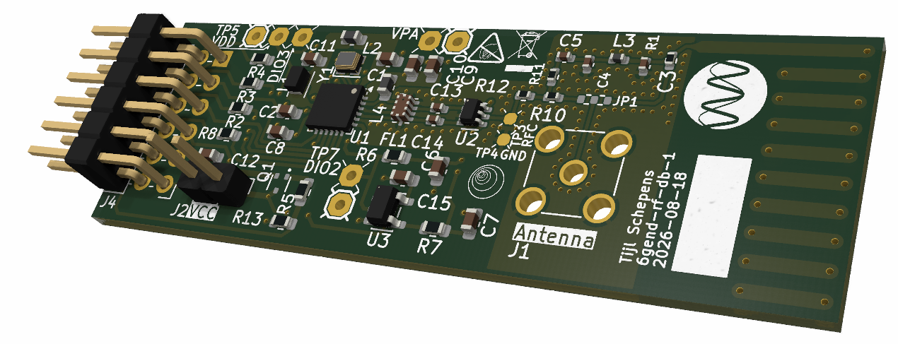

# 6gend-rf-db-1

Active RF Daughter Board for the END Platform

> Part of the **AMBIENT-6G Energy Neutral Device (END) Platform**: https://github.com/AMBIENT-6G/END-Platform

## Overview

The **6gend-rf-db-1** is an RF daughter board for the END Platform that integrates a **Semtech SX1261** sub-GHz transceiver. The board is intended as a research platform for **active LoRa communication systems** and other active radio technologies supported by the SX1261.

The design allows researchers to investigate active wireless links, power consumption, communication performance, and protocol development in the context of energy-neutral and low-power IoT systems.

The board interfaces with an END Platform main board through the standard 12-pin END Platform connector and communicates with the host MCU through an **SPI interface**.

## Features

- Semtech **SX1261** sub-GHz RF transceiver
- Support for **LoRa®** communication
- Support for **(G)FSK** modulation modes
- Support for **LR-FHSS** (Long Range Frequency Hopping Spread Spectrum)
- Dedicated TX/RX RF switch architecture
- Integrated matching and filtering network
- Low-power design utilizing the SX1261 internal **DC-DC regulator**
- Optional load-switch controlled power domain
- Supply-current measurement capability
- 32 MHz crystal reference
- END Platform compatible connector interface

## Board Image



## Purpose

The primary purpose of this board is to support research into:

- Active LoRa radios
- Ultra-low-power wireless communications
- Long-range communication systems
- Energy-neutral IoT devices
- Alternative active radio technologies supported by the SX1261
- Communication protocol evaluation and experimentation

Although LoRa is the primary focus, the SX1261 supports additional physical layers including GFSK and LR-FHSS, making the platform suitable for a broad range of wireless communication experiments.

## Hardware Architecture

### SX1261 Transceiver

The board is built around the **Semtech SX1261**, a low-power sub-GHz wireless transceiver supporting:

- LoRa®
- (G)FSK
- GMSK
- LR-FHSS

The transceiver communicates with the host microcontroller through an SPI interface.

### Clock Source

The board uses a standard **32 MHz crystal oscillator**.

> Note: This design does **not** use a TCXO (Temperature Compensated Crystal Oscillator).

### Power Architecture

To maximize efficiency, the design uses the **internal SX1261 DC-DC regulator configuration** rather than the LDO-only configuration.

An optional power-domain disconnect mechanism is provided using a **DMG1013T PMOS load switch**.

The load switch can be controlled through the END Platform connector, allowing the host controller to completely remove supply voltage from the RF section.

### Current Measurement Support

For accurate power characterization, a jumper is included across the PMOS load switch.

The jumper can be removed to insert measurement equipment and perform high-accuracy current measurements.

### RF Front-End

The RF front-end contains:

- **ASWD-S2-0003-T RF switch**
- **0900FM15K0039 matched filter**
- Matching components between the SX1261 and antenna

The SX1261 **DIO2** pin is configured as RF switch control.

The DIO2 output controls the **ASWD-S2-0003-T**, automatically selecting the appropriate RF path during transmission and reception.

### Interrupt Signalling

The SX1261 **DIO1** pin is connected to the END Platform interrupt line.

Typical uses include:

- Packet transmitted notification
- Packet received notification
- Channel activity events
- Radio status notifications

## Connector Pinout

The board follows the END Platform RF connector definition.

| Pin | Function |
|------|----------|
| 1 | Load Switch Control |
| 2 | IRQ (DIO1) |
| 3 | Reset (Active Low) |
| 4 | BUSY |
| 5 | GND |
| 6 | VCC |
| 7 | CS |
| 8 | MOSI |
| 9 | MISO |
| 10 | SCK |
| 11 | GND |
| 12 | VBAT |

## RF Interface

Transmitting and receiving RF signals is either done by connecting an external antenna through the SMA connector or the on-board antenna. The board and the antenna have been designed for 915 MHz.

The jumper JP1 selects which one is used by soldering a 0Ohm resistor on the appropriate path.

## MCU Interface

Communication with the host controller is performed through **SPI**.

Required signals:

- CS
- MOSI
- MISO
- SCK
- BUSY
- RESET
- IRQ

The SX1261 BUSY line must be respected by software to ensure correct command sequencing.

## Software Support

### RadioLib

The board has been tested with the open-source **RadioLib** library:

https://github.com/jgromes/RadioLib

## Design Status

**Status: Stable / Working**

The hardware has been:

- Designed
- Manufactured
- Assembled
- Debugged

The latest board revision has been verified and is functioning correctly.

## License

### CERN Open Hardware Licence Version 2 - Strongly Reciprocal (CERN-OHL-S-2.0)

This project is released under the **CERN Open Hardware Licence Version 2 - Strongly Reciprocal**.

You may:

- Study the design
- Modify the design
- Manufacture the design
- Distribute the design

provided that derivative hardware designs remain available under the same license.

A copy of the license can be obtained from:

https://cern-ohl.web.cern.ch/

## Citation

If you use this design in academic work, please cite:

```text
6gend-rf-db-1: Active RF Daughter Board for the END Platform,
DRAMCO Research Group, KU Leuven.
```

## Contact

**DRAMCO Research Group**  
KU Leuven – Ghent Campus  
Gebroeders De Smetstraat 1  
9000 Ghent  
Belgium

END Platform Repository:
https://github.com/AMBIENT-6G/END-Platform
